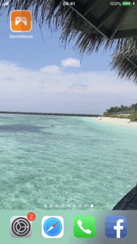

### GAME NEWS V1 ###

The app about game news built to train myself as IOS developer :)

### Tech ###
It uses the igdb.com API (v3) to fetch the news.

Was built using swift, with the following libraries:

* Alamofire - to fetch the data
* AlamofireImage - to do image transformations
* SwiftyJSON - to made the life easier to decode the json from the api
* RealmSwift - to be used in the future to store the favorite news

### How to use ###

For the app to work: 

1 - You have to get a key from igdb.com website.

2 - Paste the key in the GameNews/keys.plist file in the IGDB_KEY field value

### Developmentent status ###
Only the 'All News' section is implemented.

Recent changes is the API broke some things in the namely how to get the url of the article and the way the date is calculated.

Next step is to continue implementing the favorites section ( Realm db was already added to store the bookmarks of the articles)

